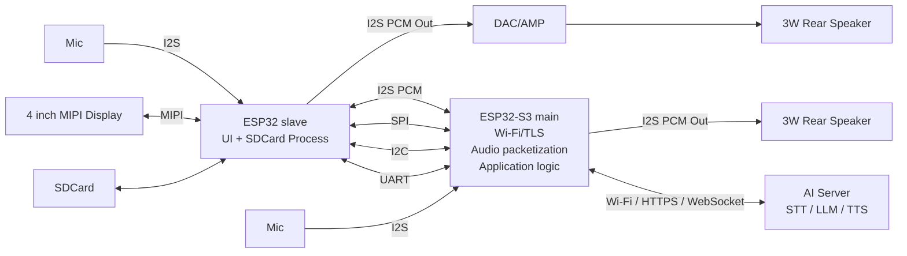

# ESP Voice Robot - System Overview

Tai lieu nay mo ta kien truc tong the ma du an muon ap dung theo so do overview moi (2 MCU: ESP32-S3 main + ESP32 slave).

## 1) Muc tieu he thong

He thong duoc chia thanh 2 khoi xu ly ro rang:

- ESP32-S3 (main): xu ly ket noi server AI, Wi-Fi/TLS, audio packetization, logic ung dung.
- ESP32 (slave): xu ly UI, MIPI display, SDCard va cac tac vu ngoai vi.

Muc tieu la tach tai nguyen va trach nhiem:

- Main tap trung cloud + voice online.
- Slave tap trung giao dien va media local.

## 2) Kien truc tong quan



## 3) Data flow muc tieu

### Upstream

- Mic -> I2S -> ESP32 (main) -> Wi-Fi -> AI Server

### Downstream

- AI Server -> ESP32 (main) -> I2S -> Speaker
- AI Server -> ESP32 (slave) -> SDCard -> LCD (hien thi/noi dung local)

Ghi chu:

- Co the mo rong de route mot so stream qua slave tuy use-case.
- Main va slave co kenh giao tiep noi bo de dong bo lenh/du lieu.

## 4) Vai tro ESP32-S3 (main)

ESP32-S3 main phu trach cac nhiem vu real-time ket noi cloud:

- Quan ly Wi-Fi, TLS, HTTP/HTTPS/WebSocket.
- Dong goi/goi ma audio packet de truyen server.
- Dieu phoi voice session (thu am, gui len, nhan TTS, phat xuong).
- Chua logic ung dung cap cao (state machine, event handling).

Trong giai doan hien tai cua repo nay, main da co:

- Audio pipeline local.
- Khoi configure Wi-Fi/BLE cho provisioning.

## 5) Vai tro ESP32 (slave)

ESP32 slave phu trach I/O va giao dien:

- Dieu khien MIPI display (glass-look face).
- Quan ly SDCard media/cache.
- Xu ly cac tac vu UI/animation local.
- Co the tham gia audio path local (tuy profile).

## 6) Giao tiep giua main va slave

He thong du kien dung dong thoi nhieu bus tuy loai du lieu:

- I2S PCM:
  - Audio stream thoi gian thuc giua 2 MCU.
- SPI:
  - Kenh data throughput cao, frame command/data.
- I2C:
  - Control nhe, peripheral coordination.
- UART:
  - Debug, log, command channel don gian.

Khuyen nghi phan lop giao thuc:

- Layer 1: transport theo bus (I2S/SPI/I2C/UART).
- Layer 2: frame header chung (type, len, seq, crc).
- Layer 3: payload theo loai (audio, ui_cmd, status, file_chunk).

## 7) AI Server contract (muc tieu)

Server la trung tam STT/LLM/TTS:

- STT: nhan audio upstream, tra text transcript.
- LLM: suy luan va tra response.
- TTS: tao audio downstream.

Transport uu tien:

- Real-time: WebSocket (streaming request/response).
- Batch/fallback: HTTPS.

## 8) Mapping voi project hien tai

Repo nay dang la nen cho khoi main (ESP32-S3 side):

- Da co audio pipeline component-based.
- Da co `robot_connectivity` cho Wi-Fi + BLE provisioning.
- Chua tich hop day du luong 2-MCU theo overview.

Noi cach khac, README nay la target architecture de trien khai tiep, khong phai 100% trang thai hien tai.

## 9) Roadmap trien khai de xuat

### Phase 1 - Main stable online

- Chot upstream/downstream cloud tren ESP32-S3 main.
- Chuan hoa packet audio va transport WebSocket/HTTPS.

### Phase 2 - Main <-> Slave backbone

- Chot 1 bus chinh cho control (SPI hoac UART).
- Chot frame protocol chung cho command/status.
- Dua I2S PCM inter-MCU vao test on dinh.

### Phase 3 - UI/SD workflow

- Chuyen logic UI + display + SDCard sang slave.
- Dong bo event voice/state tu main sang slave.

### Phase 4 - System optimization

- Dong bo clock/audio latency, retry/failover.
- Thiet lap metrics: RTT, jitter, packet loss, CPU load, memory.

## 10) Tieu chi hoan thanh

He thong dat muc tieu khi:

- Voice round-trip on dinh giua thiet bi va AI Server.
- UI display phan hoi dung state voice session.
- Main/slave giao tiep ben vung (khong lockup, co recover).
- Audio playback va networking chay dong thoi khong vo pipeline.

## 11) DTO Protocol cho PoC

Ket noi thong qua giao thuc WebSocket.

### Robot → Server

- `session.start`
- `audio.frame`
- `heartbeat`
- `session.end`

### Server → Robot

- `session.started`
- `audio.play`
- `audio.stop`
- `error`

### 11.1) Cac truong chung

```json
{
  "type": "string",
  "message_id": "string",
  "session_id": "string",
  "robot_id": "string",
  "timestamp_ms": 0,
  "payload": {}
}
```

### 11.2) Robot → Server

Ghi chu chung:

- `message_id` duoc sinh ngau nhien moi lan goi (`msg_<8 hex>`).
- `session_id` duoc sinh moi khi bat dau session (`sess_<8 hex>`), gia tri `sess_123` chi la mac dinh khi chua start.
- `robot_id` mac dinh `robot_001`.
- `timestamp_ms` la `esp_timer_get_time() / 1000` cua main.

#### session.start

```json
{
  "type": "session.start",
  "message_id": "msg_ab12cd34",
  "session_id": "sess_5f6e7d8c",
  "robot_id": "robot_001",
  "timestamp_ms": 1776300000000,
  "payload": {
    "robot_model": "esp32-bot",
    "firmware_version": "1.0.0",
    "audio_format": {
      "codec": "ogg_opus",
      "sample_rate_hz": 16000,
      "channels": 1,
      "frame_duration_ms": 20
    }
  }
}
```

#### audio.frame

Luu y:

- Truong payload chua audio base64 hien co ten la `audio_bytes` (de khop voi server / test client).
- Uplink hien la **OGG/Opus** (16 kHz, mono, frame 20 ms, ~24 kbps VBR, application=VOIP). Encoder tu mux moi packet Opus vao 1 trang OggS; goi audio.frame dau tien trong moi session co them OpusHead (BOS) + OpusTags. Server noi cac chunk base64 lai theo thu tu sequence_no de duoc OGG stream lien tuc.
- Co flag `is_final` (boolean JSON `true` / `false`) de bao frame cuoi cua mot burst upstream.
- Frame cuoi co the duoc gui voi `audio_bytes = ""` chi de bao end-of-burst.

```json
{
  "type": "audio.frame",
  "message_id": "msg_ab12cd34",
  "session_id": "sess_5f6e7d8c",
  "robot_id": "robot_001",
  "timestamp_ms": 1776300000030,
  "payload": {
    "sequence_no": 1,
    "audio_bytes": "UklGRiQAAABXQVZFZm10IBAAAAABAAEA...",
    "duration_ms": 20,
    "is_final": false
  }
}
```

#### heartbeat

Rat gon, chi de giu connection va debug co ban.

```json
{
  "type": "heartbeat",
  "message_id": "msg_0003",
  "session_id": "sess_123",
  "robot_id": "robot_001",
  "timestamp_ms": 1776300005000,
  "payload": {}
}
```

#### session.end

```json
{
  "type": "session.end",
  "message_id": "msg_0004",
  "session_id": "sess_123",
  "robot_id": "robot_001",
  "timestamp_ms": 1776300010000,
  "payload": {
    "reason": "finished"
  }
}
```

### 11.3) Server → Robot

Ghi chu chung:

- Tat ca message text JSON (khong dung binary frame).
- Main reassemble cac WebSocket fragment toi `8192` byte truoc khi parse.
- Cac field nhu `session_id`, `robot_id`, `message_id`, `timestamp_ms` khong duoc kiem tra rang buoc tren main; chu yeu dung `type` va cac field trong `payload`.

#### session.started

Main chi can `type == "session.started"` de set `session_active = true`. Cac field con lai duoc bo qua.

```json
{
  "type": "session.started",
  "message_id": "msg_s_0001",
  "session_id": "sess_123",
  "robot_id": "robot_001",
  "timestamp_ms": 1776300000010,
  "payload": {
    "status": "ok"
  }
}
```

#### audio.play

Server stream audio tra ve cho robot. Parser tren main:

- Dung fast-path khong qua cJSON de tranh peak heap khi nhan burst dai.
- Doc field PCM tu khoa `pcm_bytes`.
- Chap nhan `is_last`, `is_final_chunk`, hoac `is_final` lam co bao chunk cuoi.
- Chunk dau tien co the chua header WAV/RIFF; main tu strip 44 byte (hoac toi `data` sub-chunk) truoc khi day vao playback.
- Cac field nhu `playback_id`, `audio_format`, `timestamp_ms` hien khong duoc main su dung; chi co `type`, `sequence_no`, `pcm_bytes`, `is_last`/`is_final_chunk` la bat buoc cho hoat dong dung.

```json
{
  "type": "audio.play",
  "message_id": "msg_s_0002",
  "session_id": "sess_5f6e7d8c",
  "robot_id": "robot_001",
  "timestamp_ms": 1776300002200,
  "audio_format": {
    "codec": "pcm_s16le",
    "sample_rate_hz": 16000,
    "channels": 1
  },
  "payload": {
    "playback_id": "pb_001",
    "sequence_no": 1,
    "pcm_bytes": "UklGRlYAAABXQVZFZm10IBAAAAABAAEA...",
    "is_last": false
  }
}
```

Chunk cuoi (co the dung `is_last` hoac `is_final_chunk`):

```json
{
  "type": "audio.play",
  "message_id": "msg_s_0003",
  "session_id": "sess_5f6e7d8c",
  "robot_id": "robot_001",
  "timestamp_ms": 1776300002400,
  "payload": {
    "playback_id": "pb_001",
    "sequence_no": 8,
    "pcm_bytes": "UklGRlYAAABXQVZFZm10IBAAAAABAAEA...",
    "is_last": true
  }
}
```

#### audio.stop

Dinh nghia hop dong; main hien KHONG xu ly rieng `audio.stop` (mot tin nhan non-audio bat ky cung lam burst hien tai duoc dong va flush).

```json
{
  "type": "audio.stop",
  "message_id": "msg_s_0004",
  "session_id": "sess_5f6e7d8c",
  "robot_id": "robot_001",
  "timestamp_ms": 1776300002600,
  "payload": {
    "playback_id": "pb_001"
  }
}
```

#### error

```json
{
  "type": "error",
  "message_id": "msg_s_0005",
  "session_id": "sess_123",
  "robot_id": "robot_001",
  "timestamp_ms": 1776300003000,
  "payload": {
    "code": "BAD_AUDIO_FRAME",
    "message": "Invalid audio frame"
  }
}
```
